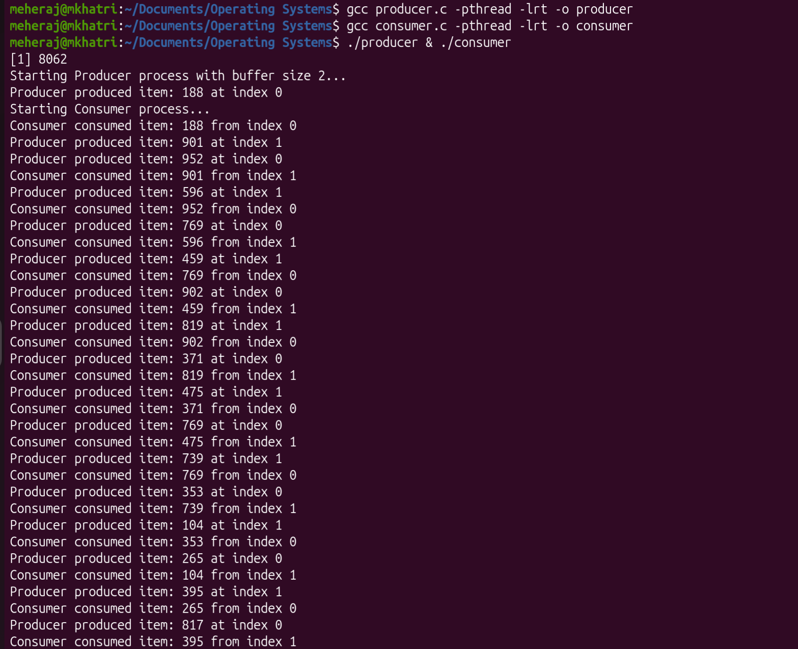
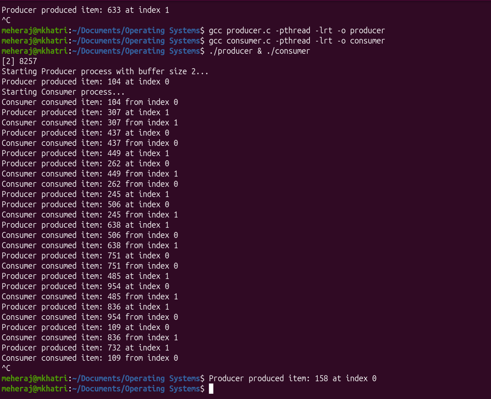

# Programming Assignment #1: Producer-Consumer Problem

This repository contains the solution for the **Producer-Consumer Problem** implemented using two separate, synchronized C programs in a Linux/Unix environment.

## Program Description

This program solves the classic Producer-Consumer Problem, where a **Producer** and a **Consumer** process share a bounded buffer.

* **Shared Buffer ("Table"):** Implemented using **POSIX Shared Memory**. The table has a capacity of **two items**.

* **Synchronization:** **POSIX Semaphores** are used to manage resource limits and enforce mutual exclusion.

* **Concurrency:** The core logic runs within separate **threads** inside the producer and consumer programs.

### Synchronization Rules

1.  When the table is full, the **Producer will wait**.
2.  When there are no items, the **Consumer will wait**.
3.  **Mutual exclusion** protects the shared buffer during access.

### Files Included

* **producer.c**: Creates the shared memory and semaphores, then runs the production thread indefinitely.

* **consumer.c**: Links to the shared resources and runs the consumption thread indefinitely.

* **global.h**: Defines shared constants, the `SharedBuffer` structure, and resource names.

* **README.md**: Documentation and usage instructions (this file).

## Usage Instructions

This solution is required to be built and run in a **Linux/Unix environment**.

### 1. Compilation
The programs must be compiled using the **GNU C Compiler (`gcc`)** and linked with the pthreads and real-time libraries (`-pthread -lrt`).

### 2. Execution
Run both programs concurrently in the background. The Producer must start first to initialize the shared resources.

### 3. Stopping the Programs
Since the programs run indefinitely (while(1)), use killall or Control + C  to terminate them.

## Explanation of Key Components

### 1. Shared Memory
Provides a memory region accessible by both the Producer and Consumer processes.

### 2. sem_empty
Initialized to 2. The Producer calls sem_wait() here; it blocks if the buffer is full.

### 3. sem_full
Initialized to 0. The Consumer calls sem_wait() here; it blocks if the buffer is empty.

### 4. sem_mutex
Initialized to 1. Both processes call sem_wait() before accessing the buffer (critical section) to ensure atomic operations.

### 5. Threads
The actual production/consumption logic runs in a separate thread inside each process, allowing for synchronous blocking operations on the semaphores.

## Examples & Results

The output below demonstrates the correct, synchronized, and continuous behavior of the programs.

### Screenshot 1:

### Screenshot 2:
